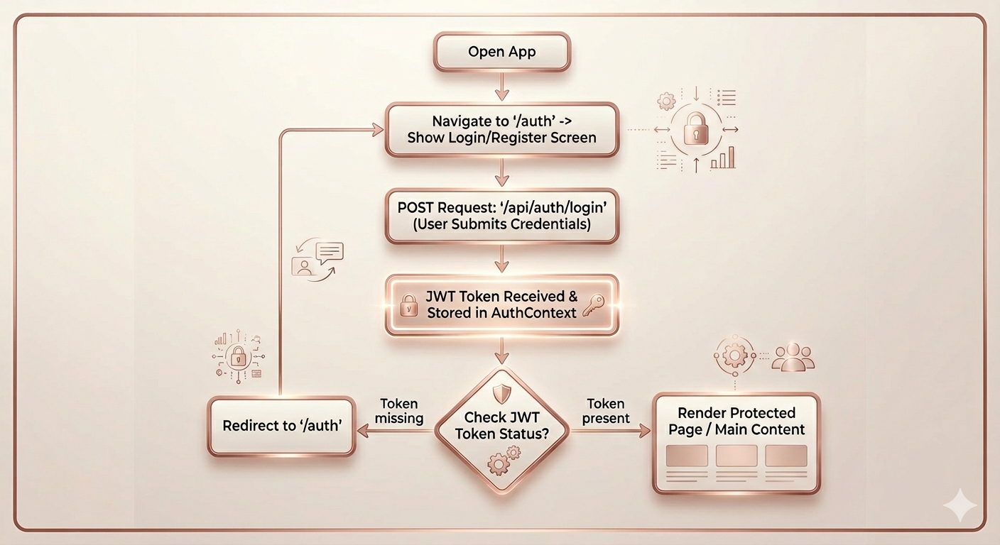
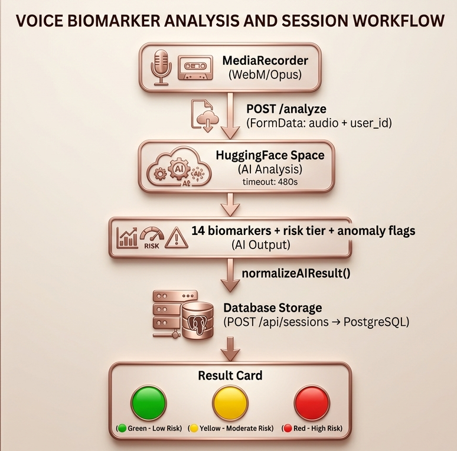

<div align="center">


# 🎨 CogniSafe Frontend
### *Everything the judges see, touch, and feel.*

[](https://react.dev)
[](https://vitejs.dev)
[](https://cogni-safe.vercel.app)
[](https://cogni-safe.vercel.app)
[](../LICENSE)

<br/>

| 🔐 `/auth` | 📊 `/dashboard` | 🎙️ `/session`  | 📄 `/ar-report` |
|:---:|:---:|:---:|:---:|
| Login | Biomarkers | Record Voice | Brain Map | PDF Export |
> A **React 18 + Vite** SPA — zero third-party UI libraries, Canvas-heavy, built demo-first.
> Every screen was designed for stage impact: judges pick it up, tap it, and remember it.

<br/>
</div>

---

## 📖 Contents

[Overview](#-overview) · [Structure](#-project-structure) · [Tech Stack](#-tech-stack) · [Pages](#-pages--features) · [Design System](#-design-system) · [Services](#-services-layer) · [Auth Flow](#-authentication-flow) · [Getting Started](#-getting-started) · [Routing](#-routing) · [ML Integration](#-ml-integration)

---

## 🧠 Overview

| Principle | Detail |
|---|---|
| 🎭 **Demo-first** | Session orb, Brain map, and Dashboard are built for stage impact |
| 🌗 **Dark/Light mode** | CSS variables per page, persisted in `localStorage` |
| 🎨 **No UI lib** | Every component custom-built in raw CSS for full design control |
| 🖼️ **Canvas-heavy** | Brain viz, sparklines, QR codes, auth background — all HTML5 Canvas |

---

## 📁 Project Structure

```
cognisafe-frontend/
├── index.html                   # Vite entry point
├── vite.config.js               # Vite + React config
├── vercel.json                  # SPA rewrite rules
│
└── src/
    ├── App.jsx                  # Router + AuthProvider
    ├── context/
    │   └── AuthContext.jsx      # Global token/user state
    ├── components/common/
    │   ├── Navbar.jsx
    │   └── ProtectedRoute.jsx   # JWT guard → /auth redirect
    ├── pages/
    │   ├── Auth.jsx             # Login / Register
    │   ├── Dashboard.jsx        # 14 biomarker cards + calendar
    │   ├── Session.jsx          # Voice recording + ML flow
    │   ├── Home.jsx            # Brain region map + trajectory
    │   └── ARReport.jsx         # Weekly PDF report
    ├── services/
    │   ├── authService.js
    │   ├── sessionService.js
    │   └── dashboardService.js
    └── styles/
        ├── global.css           # Variables, resets, utilities
        ├── auth.css
        ├── session.css
        ├── dashboard.css
        ├── home.css
        └── arreport.css
```

---

## 🛠️ Tech Stack

| Tool | Version | Purpose |
|---|---|---|
| React | 18.3 | UI framework |
| Vite | 5.4 | Build tool + dev server |
| React Router DOM | 6.26 | Client-side routing |
| jsPDF | 4.2 | In-browser PDF generation |
| Web Audio API | Native | Live amplitude visualization |
| MediaRecorder API | Native | WebM/Opus audio capture |
| Speech Recognition API | Native | Live transcript during recording |
| Canvas 2D API | Native | Brain map, sparklines, QR, neural BG |
| Vercel | — | Hosting + SPA rewrites |

---

## 🖥️ Pages & Features

### 🔐 `/auth` — Login & Register

Live **animated neural network** on Canvas — glowing nodes float and connect in real time.

| Feature | Detail |
|---|---|
| Tabs | Toggle between Login / Register |
| Password strength | Color bar: red → amber → green |
| Demo access | `demo@cognisafe.app` / `demo1234` shown for judges |
| Social UI | Google, GitHub, LinkedIn (visual only) |

---

### 📊 `/dashboard` — Biomarker Dashboard

The primary screen for daily cognitive health monitoring. Designed to give a complete picture at a glance.

**Features:**

#### 14 Biomarker Cards
- One card per biomarker in a responsive grid
- Each card shows: current value, trend percentage, direction arrow (↑ ↓ →), status dot (green/amber/red)
- **Sparkline chart** drawn on Canvas — 14-point trend line per biomarker
- Status colors: `good` (green), `warn` (amber), `crit` (red)

#### Session Calendar
- Full month calendar with navigation (← →)
- Each day with a session shows a colored dot: green (good), amber (watch), red (alert)
- Click any day to see that session's biomarker snapshot in a bottom panel
- Pulls real data from `GET /api/sessions/history`

#### Weekly Report Card
- AI-generated narrative from the backend report endpoint
- 3 insight pills with color-coded indicators
- Session count and average biomarker values for the week

#### Risk Tier Badge
- Prominent `Green / Yellow / Orange / Red` badge in the header
- Derived from the most recent session's risk tier

#### Dark / Light Mode
- Toggle button in the top right
- Persisted in `localStorage` as `cog_dark`
---

### 🎙️ `/session` — Voice Recording
The most important screen. Judges interact with this live on stage.

**States the page moves through:**

```
checking → idle → recording → processing → result (donegood / donewarn / donebad)
```

| State | What the user sees |
|---|---|
| `checking` | Spinner while checking if already recorded today |
| `idle` | Prompt + image + "Start Recording" button |
| `recording` | Live countdown timer (3:00 → 0:00) + progress ring + live transcript |
| `processing` | Pulsing animation while ML pipeline runs |
| `donegood` | Green card — "Excellent session!" |
| `donewarn` | Amber card — "Pause frequency elevated" |
| `donebad` | Red card — "Changes detected, try again tomorrow" |

**Key technical features:**
- **5 randomized clinical prompts** — picture description tasks (mountain lake, city, forest) + memory recall + navigation tasks, matching standard clinical assessment protocols
- **WebRTC audio capture** — `navigator.mediaDevices.getUserMedia({ audio: true })`
- **MediaRecorder** — records in `audio/webm;codecs=opus` (best quality) with 250ms chunks
- **Live transcript** — uses `window.SpeechRecognition` to show words appearing in real time during recording
- **Countdown ring** — SVG circle with `stroke-dashoffset` animation, color shifts gold → red in the last 45 seconds
- **HF Space warmup** — pings `GET /health` on page mount to wake the HuggingFace Space before the user finishes recording
- **AbortController** — 480 second timeout on the ML fetch with clean cancellation
- **Auto-stop** — recording stops automatically when timer hits 0

**After recording:**
1. Audio blob sent directly to `POST https://alamfarzann-cognisafe-ml.hf.space/analyze`
2. ML result normalized via `normalizeAIResult()`
3. Result saved to backend via `POST /api/sessions`
4. Risk tier result card shown to user

---


### 📄 `/ar-report` — Weekly Report & PDF

The caregiver-friendly report view.

**Features:**
- **Weekly narrative** — plain-language AI summary from `GET /api/reports/weekly`
- **3 insight pills** — color-coded (success/warn/indigo)
- **Risk tier banner** — large, prominent, plain-language status
- **Biomarker summary table** — key metrics with status indicators
- **Session streak counter**
- **QR code** — drawn on Canvas, decorative (links to platform)
- **PDF Export** — uses `jsPDF` to generate a professional A4 report entirely in-browser:
  - Dark green header with CogniSafe branding
  - Risk tier badge
  - Biomarker summary table
  - Weekly narrative
  - Page footer with timestamp
---

## 🎨 Design System

### Colors

```css
--navy:      #0A1628   /* backgrounds      */
--amber:     #E8A020   /* accent / CTA     */
--off-white: #F4F6FA   /* light surfaces   */
--good:      #10B981   /* healthy          */
--warn:      #F59E0B   /* watch            */
--crit:      #EF4444   /* alert            */
```

### Status Mapping

```
ML risk tier  →  UI status
──────────────────────────
"Green"       →  good   🟢
"Yellow"      →  warn   🟡
"Red"         →  bad    🔴
```

> System font stack throughout — no external fonts, maximum reliability.

---

## 🔌 Services Layer

### `authService.js`
```js
loginUser(email, password)
registerUser(name, email, password, dob)
// → { access_token, user_id, name, email }
```

### `sessionService.js`
```js
checkToday(token)               // → { recorded, risk_tier, session_id }
analyzeAudio(audioBlob, userId) // → normalizedAIResult  (480s timeout)
saveSession(token, aiResult)    // → saved session
normalizeAIResult(raw)          // → { risk_tier, biomarkers, anomaly_flags }
```

### `dashboardService.js`
```js
getProfile(token)
getSessionHistory(token, months)  // → [ HistoryItem ]
getLatestSession(token)
getWeeklyReport(token)
getTrajectory(token, months)      // → [ TrajectoryPoint ]
```

---

## 🔐 Authentication Flow


```bash
# 1. Install
cd cognisafe-frontend && npm install

# 2. Environment
cp .env.example .env          # set VITE_API_URL

# 3. Dev
npm run dev                   # → http://localhost:5173

# 4. Production build
npm run build && npm run preview
```

### Environment Variables

```env
# .env (local)
VITE_API_URL=http://localhost:8000

# Vercel dashboard (production)
VITE_API_URL=https://your-backend.onrender.com
```

> ML URL (`https://alamfarzann-cognisafe-ml.hf.space`) is hardcoded in `sessionService.js` — it's a public endpoint.

---

## 🗺️ Routing

| Route | Component | Auth | Description |
|---|---|---|---|
| `/` | — | — | Redirect → `/auth` |
| `/auth` | `Auth.jsx` | ❌ | Login / Register |
| `/dashboard` | `Dashboard.jsx` | ✅ | Biomarker overview |
| `/session` | `Session.jsx` | ✅ | Voice recording |
| `/ar-report` | `ARReport.jsx` | ✅ | Report + PDF export |


---

## 🤖 ML Integration


**Cold start strategy** — HF free tier sleeps after inactivity:

| Warmup | Where | Effect |
|---|---|---|
| App-level | `App.jsx` pings `/health` on mount | Wakes Space on every visit |
| Session-level | `Session.jsx` pings `/health` on page open | 1–3 min warmup while user reads prompt |

---

<div align="center">

Built by **Ishika Rawat** · Team FAIV 🎨

[](https://alamfarzann-cognisafe-ml.hf.space)
[](https://github.com/WTC-Group-3/wtc-round-2-group-3-faiv)
[](../README.md)

</div>
